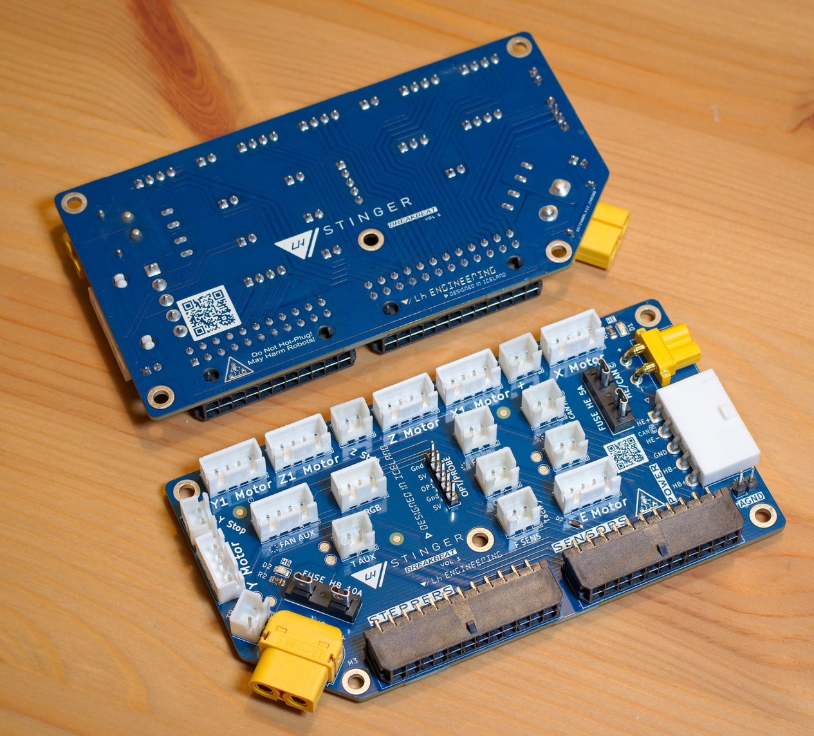

# LHS Breakbeat

- [LHS Breakbeat](#lhs-breakbeat)
  - [Features](#features)
  - [Specifications](#specifications)
  - [BOM](#bom)
  - [Notes](#notes)
- [Wiring Harness](#wiring-harness)
- [Guide](#guide)
- [Acknowledgments](#acknowledgments)

 

**Disclaimer**

>*This is a DIY (Do-It-Yourself) experimental project. This PCB is provided "as is" without any guarantees or warranty, and is not certified for any commercial or critical applications. Use it at your own risk. 
The creator assumes no liability for damages or injuries resulting from its use, including but not limited to fire, electric shock, personal injury or property damage.*
>*By using this PCB, you agree to the terms of this disclaimer.*

 

**NOTE: this design is currently in testing**  

 

**LHS Breakbeat** is a breakout board built for the LH Stinger, meant to provide an easy interface between the external electronics box and the printer electronics.

This board is meant to be mounted on the printer, and make most of the wiring setup plug and play.

## Features
* Support for 7 stepper motors
* 3 Thermistors
* 3 Fans with individual power requirements
  * 4-pin fan support
* 4 Endstops
* RGB lighting
* Optional probe header
* Filament Sensor (Tach and F Sens pins are shared)
* Fused bed and hotend power lines 
* Support for separate thermistor analog ground
* CAN bus alternative wiring
* Thermistor test points
* Tachometer diode protection

 

## Specifications

Note: these guideline limits are on top of your mainboard specifications, along with the wires and connectors used for the wire harness.

Circuit | Limit
--|--
Hotend Heater | 24V, 115W, 4.8 A 
Bed Heater | 24V, 220W, 9.2 A
Fans | 24V, 2 A 
RGB/5V | 2A
Steppers | 2.7 A

## BOM
Please see the [Interactive BOM](https://htmlpreview.github.io/?https://github.com/lhndo/LH-Stinger/blob/main/PCB/LHS%20Breakbeat/BOM/ibom.html)

## Notes

* The BOM included links to paired connectors and crimps
* The Molex MiniFit Paired Power Connector (03-04-4052) requires 16AWG 13A crimps (45750-3112)

 

# Wiring Harness

 

# Guide

https://github.com/lhndo/LH-Stinger/wiki/Breakout-Box

# Acknowledgments

*Thanks to [@roerich_64](https://github.com/walterwissmann) and the LHS community for the help and guidance with this project!*

